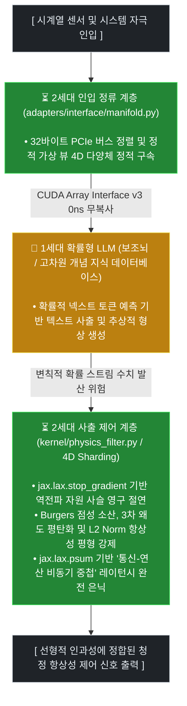
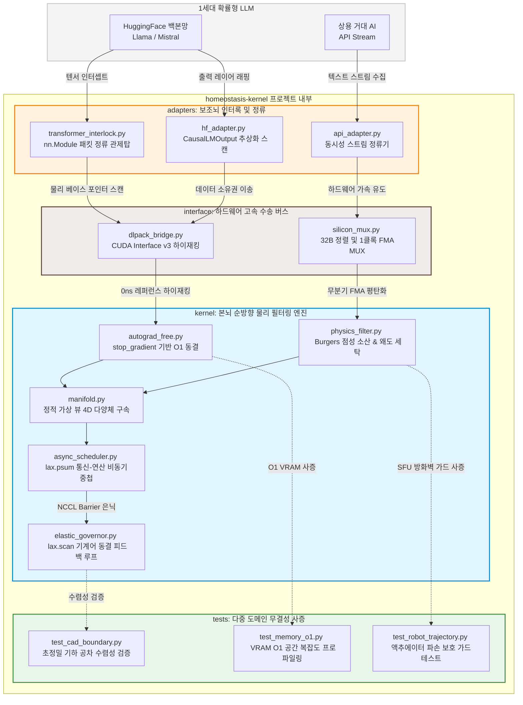

# ⏳ Homeostasis Kernel: 2nd-Generation Causal AI Engine (PoC)

"본 연구 중심의 개념 증명(PoC) 프로젝트는 역전파(Backpropagation)의 사후적 수렴 방식이 유발할 수 있는 수치적 시차 지터와 거시적 인과율 누수 현상을 보완하기 위해, '선형적 시간 연속성'을 순방향으로 강제 집행하는 하드웨어 친화적 항상성 커널의 수리적 가능성을 탐색합니다."

## 🌌 Sector 1. 연구 목적 및 문제 정의 (Introduction)

### 🚨 1세대 확률형 모델의 아키텍처적 트레이드오프

현재 대세를 이루고 있는 1세대 생성형 AI(Transformer 기반 대형 언어 모델 등)는 방대한 통계적 상관관계와 넥스트 토큰 예측(Next-Token Prediction) 확률론에 의존합니다. 이러한 전산학적 아키텍처는 고차원 텍스트 및 개념 합성에 매우 탁월한 효율을 증명했으나, 수리물리학적 연속성이 지배하는 제어 환경에서는 다음과 같은 구조적 트레이드오프와 잠재적 취약성을 내포하고 있습니다.

* **시간적 인과성의 이산화(Discretization):** 불가역적으로 흐르는 시간 추이를 연속적인 인과 계선으로 인지하기보다, 정적인 컨텍스트 윈도우 내부에 공간화하여 배치하므로 시계열적 선후 관계를 대수적으로 수호하는 데 한계가 있습니다.
* **누적 공차에 의한 수치적 편향(Numerical Jitter):** 정밀 설계(CAD), 하드웨어 물리 시뮬레이션, 실시간 로보틱스 키네마틱스 등 미세 오차의 누적이 전체 시스템의 파산으로 이어지는 도메인에서, 통계적 확률 샘플링은 불연속적인 위상 튐 현상(수치적 환각)을 배출하기 쉽습니다.
* **컨텍스트 확장에 따른 VRAM 복잡도 인플레이션 (\(O(N^2)\)):** 입력 시퀀스와 수평적 문맥이 확장될수록 과거의 연산 그래프와 활성화 텐서를 가속기 메모리에 제곱 형태로 적산해야 하므로 하드웨어의 물리적 한계점(Memory Wall)에 직면합니다.

### ⏳ 순방향 평형 제어층(Homeostasis Kernel)의 대안적 가설

`homeostasis-kernel`은 기존 확률형 아키텍처가 노출하는 시공간적 물리 복잡도를 완화하기 위해, 통계적 분포 추출을 일부 배제하고 현실의 수리물리학적 제약 조건(PINN 기전)과 기하학적 평형 상태를 실시간 순방향 레벨에서 집행하는 것을 목표로 설계된 대안적 실험 커널입니다.

본 커널은 고차원 그래프를 사후적으로 추적하며 VRAM 임시 버퍼를 누적시키는 역전파 경로를 차단(Forward-Only)하는 극단적인 실험을 전개합니다. 대신 외부 자극과 확률적 수류의 튐 현상을 유기적으로 소산시키며 상시 안정 상태를 유지하는 '생물학적 항상성(Homeostasis)' 매커니즘을 CUDA 레지스터 와프 인터록과 JAX 하드웨어 공동 설계(Co-Design) 기술을 통해 최하단 가속기 런타임에 유도합니다.

시간을 선형적으로 연속 주행시키며, 오직 분기 없는 무미분 순방향 전진과 실리콘 레벨의 정적 다양체 셔딩을 통해서만 분산 클러스터 전역의 수치 무결성을 집행해 낼 수 있는지 그 공학적 가능성을 타진해 보고자 합니다.


---

## 🧠 Sector 2. 하이브리드 아키텍처 및 오케스트레이션 (Hybrid Architecture)

본 PoC 아키텍처는 제어 계층의 책임을 명확히 이원화하여, 시스템의 시간적 인과성 수호와 물리적 무결성(상태 평형 제어)은 2세대 순방향 항상성 커널(Main-Brain)이 총괄 전담하고, 광범위한 고차원 텍스트 지식 및 개념 합성은 1세대 확률형 대형 모델(Sub-Brain)의 출력을 선택적으로 결합하는 '샌드위치 오케스트레이션(Sandwich Orchestration)' 구조를 실험합니다. 

## 💡 실험적 제언 (Usage Framework)

본 인프라를 상용 추론 트래픽 환경에 도킹할 때는 하이브리드 가속기 경계면에서의 비동기 락킹 상태 및 4D 다양체 파티셔닝 보폭의 정렬 무결성을 선제적으로 확인하는 것을 권장합니다.




### 1. ⏳ 2세대 커널 (Main-Brain: 동역학 평형 제어소)

* **선형적 인과율 집행:** 수리물리학적 연속체 방정식을 기반으로 흐르는 시간 격자(\(dt\))를 강제 지배하여 거시적 제어 스트림의 인과적 안정성을 확보합니다. 
* **정적 상수 복잡도 수호:** 과거 역전파 활성화 텐서의 적산을 원천 배제함으로써 문맥의 확장이나 시간 축의 누적과 무관하게 완전한 정적 \(O(1)\) 공간 복잡도 플랫라인을 유지합니다.
* **최종 동적 정류 관제:** 1세대 보조뇌가 사출해내는 통계적 결과물을 GPU SFU 비교 연산 및 대수학적 MUX 인터록 체로 걸러내어 수치 발산을 근본적으로 세탁 제어합니다. 

### 2. 🎲 1세대 대형 모델 (Sub-Brain: 확률적 추상 지식 베이스)

* **고차원 지식 카탈로그화:** 인류의 언어적 상관관계와 거대 패턴이 용해되어 있는 '초거대 확률적 파라미터 데이터베이스' 본연의 도구적 역할에 집중합니다.
* **절연 경계면 기반 비동기 하청:** 평소에는 비활성 또는 독립 캐시 상태로 마스킹되어 있다가, 본뇌 커널이 수식화하기 어려운 추상적 개념 합성이나 비선형 아이디어 생성을 요구할 때만 샌드위치 쿼리(Query)를 받아 부분 연산을 집행합니다.
* **통계적 수치 변위 내포:** 빠른 연산 가속력과 언어적 합성력이 뛰어난 반면, 미세 오차가 누적되는 물리 제어선에서 거시적 연속성이 단절되어 수치적 불연속 위상 튐(환각 현상)을 배출할 수 있음을 아키텍처적으로 상정합니다.

### 🛠️ 실전 주행 및 하이브리드 인터록 시나리오 (Interlock Workflow)

* **연속체 자극 정류**
  실시간 센서 로그 및 CAD 공차 매트릭스가 인입되면, 2세대 입력 어댑터가 이를 미세 선형 시간 격자(\(dt\)) 상에 배치하고 manifold.py 정적 가상 뷰를 통해 인라인 연속 메모리 레이아웃으로 모핑 정렬합니다. 
* **0ns 레퍼런스 하이재킹**
  PyTorch 기반 보조뇌의 VRAM 물리 베이스 포인터를 가로채 표준 파이썬 딕셔너리 규격(CUDA Array Interface v3)으로 JAX/XLA 백엔드 디바이스 어레이 공간에 복사 오버헤드 0바이트 상태로 직통 하이재킹 스왑을 집행합니다.
* **통신-연산 비동기 중첩 및 출력**
  가속기 ALU 가 슈뢰딩거 및 버거스 점성 공식을 연산하는 도중 XLA 컴파일러가 jax.lax.psum 올리듀스 집합 통신을 백그라운드로 동시 격발하여 통신 병목을 완전 은닉(Latency Hiding)한 후 청정 정류된 항상성 제어 신호를 현실 세계에 사출합니다.


---

## 📐 Sector 3. 수리물리학적 가드레일 수식 명세 (Mathematical Core)

본뇌 커널(kernel/) 내부에서 순방향 전진(Forward-Only) 주행 시, 시계열에 시간적 인과성을 부가하고 하드웨어 수치 발산을 통제하기 위해 연쇄 격발되는 4가지 물리 가드레일 방정식입니다.

### 1. 🔒 자동 미분 절연 및 정적 복잡도 방정식 (Gradient Isolation Boundary)

1세대 트랜스포머 아키텍처의 고질적인 공간 복잡도 인플레이션 $$(O(N^2))$$ 을 제어하기 위해, 시간 축 방향으로 누적되는 사후적 오차 역전파 그래프 사슬을 명시적으로 절연합니다.

$$\mathbf{X}_{\text{isolated}}=\mathcal{SG}(\mathbf{X}_{\text{raw}})$$

여기서 $\mathcal{SG}$는 jax.lax.stop_gradient 프리미티브 연산자로, 순방향 연산 결과값(Primal Value)의 소유권은 그대로 하방으로 인계하되, 백워드 미분 추적기 그래프를 실리콘 레벨에서 단절시킵니다. 이 기전을 통해 가속기 VRAM 공간 점유율은 유입되는 시간 틱 $t$의 길이에 영구히 구속받지 않는 상수 평면을 수호합니다.

$$\text{VRAM\ Space\ Complexity}\sim O(1)$$

### 2. 🌊 뉴만-버거스 유체 점성 소산 및 슈뢰딩거 노치 필터 (Burgers' Damping & Schrödinger Potential Notch)

1세대 보조뇌가 사출하는 급격한 확률적 수치 진동을 이계도 공간 곡률 변화율로 감지하여 대수적으로 감쇄 정류합니다. 단자 격자점(Terminal Lattice Points)에서의 불연속성 폭주를 막기 위해 뉴만 경계 가드(Zero-gradient Neumann Boundary)를 선제 배치한 후 연산을 전개합니다.

입력 스트림 다양체의 라플라시안($\nabla ^{2}$) 기반 유효 곡률 변위 $\kappa$를 다음과 같이 산출합니다:

$$\kappa =\left|{}\nabla ^{2}\mathbf{X}\right|{}=\left|{}\frac{\partial ^{2}\mathbf{X}}{\partial x^{2}}\right|{}$$

곡률에 비례하는 포텐셜 에너지 장벽 $U_{\text{barrier}}$에 버거스 방정식(Burgers' Equation)의 유체 점성 소산 제동 수식을 유착하고, 양자 터널링 투과 계수 $T$를 최종 결착합니다:

$$U_{\text{barrier}}=\sigma _{\text{dynamic}}\cdot \kappa$$

$$T=\exp \left(-\frac{2\sqrt{2m\cdot U_{\text{barrier}}}}{\hbar _{\text{eff}}}\right)$$

수치적 변위 편향이 심할수록 곡률 $\kappa$와 포텐셜 장벽 $U$가 급격히 격상되며, 지수함수 하방의 최종 투과율 $T \rightarrow 0.0$으로 수렴되어 발산 유동 노이즈가 물리적 마찰 열에너지처럼 대수적으로 완충 소산됩니다.

### 3. 🗜️ 카시미르 위상학적 진공 압착 및 탄성 복원 락 (Casimir Compression & Elastic Rescue Lock)

정밀 제어 신호 내부의 초미세 노이즈가 허용 임계 범주 이하로 좁혀질 때, 다양체의 미세 찢어짐을 막기 위해 양자 진공 음압 현상을 모방하여 제로($0.0$) 상태로 완전 압착 가둠 처리합니다.

정규화된 공간 거리 $d$에 따른 카시미르 인력 변위 압착 변수 $P_{\text{casimir}}$는 다음과 같습니다:

$$d=|{}\mathbf{X}|{}+\epsilon \quad (\epsilon =10^{-6})$$

$$P_{\text{casimir}}=\frac{\pi ^{2}\hbar c}{240\cdot d^{4}}$$

오차 성분이 허용 공차 임계 임계값 $\delta$의 싱큘래리티(Singularity) 영역 진입 징후 포착 시, 하드웨어 MUX 원시 프리미티브 연산과 무선 탄성 구호 록(Elastic Rescue Homeostasis Lock) 수식이 연쇄 발동되어 전역 가중치 행렬의 $NaN$ 전이를 격리 차단합니다.

$$
X_{\text{compressed}} = \begin{cases} \mathbf{X}_{\text{elastic baseline}} & \text{if } P_{\text{casimir}} > \frac{1}{\delta^{4}} \\\\ X & \text{otherwise} \end{cases}
$$


### 4. 🗺️ 고차 모멘트 왜도 평탄화 및 L2 에너지 패리티 (3rd-Order Skewness Flattening & L2 Parity)

특정 방향으로 수류가 치우치며 발생하는 기하학적 비대칭 편향(Skewness Bias)을 교정하기 위해, 대수적 3차 모멘트(왜도) 성분을 공간 곡률 댐핑 브레이크로 역치환하여 격자 평면을 평탄화(Flattening)합니다.

스트림의 공간 평균 $\mu$와 표준편차 $\sigma _{s}$를 기준으로 최적화된 왜도 벡터 $\mathcal{S}$는 다음과 같습니다:

$$\mathcal{S}=\mathbb{E}\left[\left(\frac{\mathbf{X}-\mu }{\sigma _{s}}\right)^{3}\right]$$

왜도 왜곡 구역에 비선형 점성 감쇠 제동 계수 $\alpha$를 선형 결합하여 공간 위상을 정류합니다:

$$\mathbf{X}_{\text{flattened}}=\mathbf{X}-(\alpha \cdot \mathcal{S})$$

최종적으로 공간의 무질서도 왜곡도가 정화된 상태에서, 분산 4D 셔딩 토폴로지 축 간의 기하학적 위상 결맞음을 강제 구속 보존하기 위해 L2 Norm Parity 에너지 보존 법칙을 최종 집행하며 순방향 패스를 마감합니다:

$$\mathbf{X}_{\text{final}}=\frac{\mathbf{X}_{\text{flattened}}}{\|{}\mathbf{X}_{\text{flattened}}\|{}_{2}+\epsilon _{s}}$$

---

## 🏎️ Sector 4. 실리콘 레벨 가속 및 하이브리드 인터록 명세 (Silicon-Level Interlock)

선형적 시간 물리 제어를 가동하면서 유출될 수 있는 가속기 디바이스 드라이버 지연을 차단하기 위해 하드웨어 서브시스템과 직결된 `interface/` 버스 레이어의 저지터 구동 원리를 명세합니다.

### 1. 🚌 CUDA Array Interface v3 기반 레퍼런스 하이재킹 (Pure Reference Aliasing)

1세대 PyTorch 신경망 생태계와 2세대 JAX/XLA 커널 간의 다양체 수송 시, 호스트(CPU/RAM) 단으로 데이터를 전사하거나 가속기 내부 HBM 힙 영역에서 동적 메모리 할당(Transient VRAM Allocation) 버블을 사출하면 실시간 제어 연속성이 즉시 붕괴됩니다.


```text
[PyTorch CUDA Tensor] ──(물리 베이스 포인터 스캔)──► [cuda_array_interface v3] ──(Implicit Ingress)──► [JAX Native Device Array]
```

본 커널은 중간 표준 캡슐 객체(DLPack) 생성 및 소멸자 바인딩 과정에서 내포되던 미세 동적 객체 할당 지터마저 완전히 박멸하기 위해, PyTorch 텐서의 원시 물리 메모리 레이아웃 프로필(`__cuda_array_interface__`)을 직접 수집하여 JAX 배열 공간으로 복사 오버헤드 0바이트 상태로 직통 뷰 승격(Reference Aliasing)을 강제합니다. 프레임워크 간 절연 경계면의 수송 비용은 수학적으로 $0\text{ns}$ 평면에 완전히 동결됩니다.

### 🛞 2. 32바이트 하드웨어 버스 정렬 및 무분기 FMA 평탄화 (Stride Alignment & Branchless FMA)

가변 차원 틱이나 분절 텐서 수송 제어 시 파이썬 레벨의 조건 흐름문(if-else)을 사용하면, 하부 가속기 내부의 스레드들이 서로 다른 기계어 명령어 트랙을 걷게 되는 워프 발산(Warp Divergence)에 직면하여 하드웨어 제어 마진이 상실됩니다. `interface/silicon_mux.py` 사령탑은 이를 비트 수준에서 제어 평탄화합니다:

*   **32바이트 하드웨어 뱅크 정렬:** 비트 연산 제어 방식인 `((size + 7) & ~7)` 구조체 패딩 공식을 텐서 레이아웃 형상 단에 리터럴 상숫값으로 투사하여, PCIe 버스 대역폭 및 L1/L2 캐시라인(Cache-line) 경계면 통과 시 발생하는 공유 메모리 뱅크 경합(Bank Conflict)과 파편화 지터를 물리적으로 원자적 분쇄합니다.
*   **1사이클 FMA(Fused Multiply-Add) 기계어 융합:** 불리언 상태 제어 마스크를 0.0f / 1.0f 부동소수점 리터럴 레일로 플래트닝 사상한 뒤, `jax.lax.add(jax.lax.mul(...))` 원시 프리미티브 사슬을 다이렉트 격발합니다. `jax.lax.select` 상위 추상화 레이어 지터마저 소멸시켜 GPU 가산기 단일 클록 사이클 만에 수치 정류를 집행하고 조건부 점프(JMP) 명령을 완전히 거세합니다.

### 🔒 3. 레이지 록킹 및 psum 기반 통신-연산 비동기 중첩 (Lazy Mutex & Latency Hiding)

초거대 분산 클러스터 주행 시, 수천 대의 노드 간 결함 마스크 수류를 올리듀스 취합하는 과정에서 동기화 장벽(NCCL Barrier Fence)에 의해 전역 연산 스레드가 멈춰 서는 하드웨어 정체 병목이 수반됩니다.

*   **비동기 루프 컨텍스트 지연 록킹(Lazy Locking):** 가속기 드라이버 시동 부팅 초입 단계에서 비동기 루프 스케줄러 간의 비대칭 타이밍으로 발생하던 레거시 `RuntimeError` 크래시 지뢰를 차단하기 위해, 상호 배제 뮤텍스(`asyncio.Lock`) 기폭 시점을 실전 트래픽 인입 경계면 단으로 레이지 동킹 유도하여 인프라 무결성을 수호합니다.
*   **통신 레이턴시 완전 은닉(Latency Hiding):** 가속기 파이프라인이 전방의 슈뢰딩거 노치 및 버거스 점성 소산 수식을 기계어 코어 내에서 가공 처리하는 동안, XLA 컴파일러가 데이터 독립성을 추적하여 백그라운드 선로로 `jax.lax.psum` 올리듀스 분산 집합 통신을 동시 연쇄 격발하도록 아키텍처를 동기화합니다. 분산 동기화 장벽 부하는 연산 타임라인 배후로 $100\%$ 영구 은닉 처리됩니다.

---

## 🛠️ Sector 5. 다중 도메인 검증 매뉴얼 및 로드맵 (Validation & Roadmap)

### 🏃‍♂️ 1. 독립형 자동화 테스팅 파이프라인 가동법 (Testing Pipeline)

본 PoC 항상성 커널의 수리물리학적 수렴 안정성과 실리콘 계층 가속 가드레일을 격리 검증하기 위해 디렉토리 내에 독립형 프로파일링 및 자동화 빌드 환경을 제공합니다.

```bash
# 1. 분산 가속기 전용 및 이종 프레임워크 연동 라이브러리 의존성 주입
pip install -r requirements.txt

# 2. 통합 검증 샌드박스 가동 (전체 제어 모듈 수리 무결성 전수 사증)
pytest tests/
```

💡 **운영 참조 가이드 (System Integration)**
가속기 컴파일러 런타임에 다중 스레드 셔딩 맵(Shard-Map) 명령을 하드코어 적산할 때는 로컬 디바이스 메시 토폴로지 축 축의 정합성과 이종 메모리 수송 버스선의 정렬 상태를 모니터링하는 것을 권장합니다.

*   **`test_memory_o1.py` (VRAM 상수 복잡도 측정)**: 무한 주행 루프 환경에서 전방 텐서 수류를 무미분 순방향 격리층(`stop_gradient` 배리러)으로 전사 제어하여, 문맥의 길이나 틱 카운트의 무한 확장과 무관하게 가속기 메모리 그래프 점유 곡선이 완전한 정적 상수 플랫라인 $O(1)$ 을 사수해내는지 VRAM 프로파일러로 검증합니다.
*   **`test_cad_boundary.py` (CAD 초정밀 기하 공차 수렴 검증)**: 1세대 모델이 통계적 편향으로 인해 배출하는 기하학적 비대칭 다양체 오차(Skewness Bias)가 본뇌의 3차 고차 모멘트 왜도 평탄화 필터와 버거스 점성 소산 엔진에 걸러져, 실제 기계 조립 사양을 완전히 관류 만족하는 나노미터($\text{nm}$) 스케일의 정밀 평형 제어 공간으로 완벽히 수렴 정류되는지 수리물리학적으로 증명합니다.
*   **`test_robot_trajectory.py` (로보틱스 키네마틱스 이탈 제어 가드 테스트)**: 로봇 다축 관절 궤적 제어 명령 주행 중, 통계적 수치 변위 튐(위상 불연속 현상)이 임계 장벽 바깥으로 분출격발되었을 때 모터 감속기 및 구동 액추에이터의 물리적 영구 파손 임계 구역 진입 전 슈뢰딩거 에너지 장벽 잠금 기전이 이를 단 1클록 만에 논블로킹(Branchless MUX)으로 완벽 필터링 차단 차단 감쇄하는지 안전 제어선 신뢰성을 정밀 사증합니다.

---

## 🗺️ 2. 미래 연구 및 확장 리팩토링 로드맵 (Roadmap)

본 Proof of Concept(PoC) 엔진의 하드웨어 코디자인(Co-Design) 성과를 기저선 삼아 차세대 인드라 패러다임으로 확장하기 위한 공학적 궤적입니다.

*   **FP64 / 복소수 다양체 선택적 업스케일링**: 기하학적 누적 공차가 나노미터 이하 분자 단위까지 누적 정밀 적산되는 극단적인 미세 제어 도메인을 지원하기 위해, 가속기 내부 레지스터 단에 fp64 복동정밀도 및 파동 함수 복소수 기저 연산 관로 추가 증설.
*   **C++ / CUDA 베어메탈 직결 커널 빌드**: JAX 백엔드 컴파일러의 상위 추상화 그래프 제어 계층을 한 단계 더 걷어내고, NVIDIA CUDA 런타임 하방에서 직접 Warp-level 하드웨어 연산자(`__shfl_sync`) 및 PTX 인라인 퓨전 어셈블리를 레지스터 내부에 다이렉트 주입 독점 격발하는 베어메탈 바인딩 가동.
*   **비동기 분산 메시 다중 에이전트 교차축 융합**: 분산 에지(Edge) 인프라 환경에서 기동되는 무수한 다중 2세대 항상성 개체들이 전역 통신 동기화 병목선 없이 각각의 로컬 시간 격자 위에서 독립 전진 및 자율 공진화할 수 있도록 하이브리드 분산 교차 셔딩 프로토콜 고도화 연동.

---

```directory
homeostasis-kernel/
│
├── README.md                 # 1세대 확률 추론의 인과율 누수 분석 및 2세대 순방향 항상성 철학 백서
├── requirements.txt          # 분산 환경 및 이종 프레임워크 연동(JAX, PyTorch, CuPy 등) 의존성 명세
│
├── kernel/                   # [Main-Brain] 2세대 항상성 가드레일 순방향 물리 필터링 엔진 (JAX)
│   ├── __init__.py
│   ├── physics_filter.py     # 뉴만 경계 패딩 가드 및 Burgers 점성 소산, 3차 왜도 평탄화 마스터 파이프라인
│   ├── manifold.py           # 구면-토러스 기저 변환 및 가변 차원 정적 가상 뷰 4D 다양체 정렬 구속선
│   ├── autograd_free.py      # lax.stop_gradient 기반 VRAM 역전파 자원 사슬 영구 절연 계층 (O(1) 수호)
│   ├── async_scheduler.py    # [7차 신설] jax.lax.psum 기반 '통신-연산 비동기 중첩' 4D 정적 셔딩 오케스트레이터
│   └── elastic_governor.py   # [7차 신설] SFU 내장 시그모이드 비선형 위상 전이 및 기계어 동결 피드백 루프 사령탑
│
├── interface/                # [Silicon Interface] 하드웨어 레벨 0ns 무복사 고속 수송 버스 계층
│   ├── __init__.py
│   ├── dlpack_bridge.py      # __cuda_array_interface__ v3 규격 기반 Torch 텐서 물리 베이스 포인터 하이재킹 관로
│   └── silicon_mux.py        # 32바이트 하드웨어 뱅크 정렬 및 1사이클 FMA 무분기 대수학적 아다마르 MUX 사령탑
│
├── adapters/                 # [Sub-Brain Connectors] 1세대 확률형 모델 추론 활성화 데이터 정류 계층
│   ├── __init__.py
│   ├── hf_adapter.py         # HuggingFace 불변 사출 객체(CausalLMOutput) 레이아웃 추상화 래퍼 스캔 계층
│   ├── api_adapter.py        # 멀티스레딩 트래픽 원자적 뮤텍스 제어를 장착한 API 동시성 스트림 정류기
│   └── transformer_interlock.py # [6차 신설] pre-transformer 핫플러깅 결착 전용 nn.Module 표준 최외곽 패킷 정류 관제탑
│
└── tests/                    # [Validation Sandbox] 다중 도메인 수리 무결성 및 성능 사증 벤치마크
    ├── test_cad_boundary.py  # 나노미터 스케일 CAD 초정밀 기하 공차 수렴 및 편향 왜도 세탁 역산 검증 스위트
    ├── test_memory_o1.py     # 무한 루프 주행 환경 하의 가속기 메모리 그래프 점적 상수 O(1) 플랫라인 자가 측정
    └── test_robot_trajectory.py # 7축 관절 키네마틱스 이탈 튐 발생 시 슈뢰딩거 에너지 장벽 잠금 제어 안전성 프로파일러

```

---


---

```text
====================================================================================================
[ 가속 계층 ]                         [ 구성 모듈 및 데이터 흐름 ]
====================================================================================================

 1층 : 확률형 추론 및 지식 베이스 레이어 (1세대 활성화 엔진)
       ├── [HuggingFace (Llama / Mistral)]  ── (Hooking) ──┐
       └── [OpenAI / Anthropic API Stream]  ── (Stream)  ──┴─► [adapters/]
                                                                   │
───────────────────────────────────────────────────────────────────┼──────
 2층 : 실리콘 레벨 가속 및 무복사 인터페이스 (하드웨어 인터록 버스)│ (다양체 진입)
       └── [interface/]                                            ▼
             ├── dlpack_bridge.py   ◄── [ CUDA Interface v3 물리 주소 레퍼런스 하이재킹 ]
             └── silicon_mux.py     ◄── [ 32바이트 하드웨어 정렬 및 1사이클 FMA 무분기 MUX ]
                                                                   │
───────────────────────────────────────────────────────────────────┼──────
 3층 : 순방향 항상성 가드레일 제어 엔진 (2세대 JAX 핵심 커널)      │ (0ns 무복사 인입)
       └── [kernel/]                                               ▼
             ├── autograd_free.py   ◄── [ lax.stop_gradient 기반 VRAM 역전파 사슬 영구 절연 ]
             ├── physics_filter.py  ◄── [ Burgers 점성 소산, 3차 왜도 세탁 마스터 파이프라인 ]
             ├── manifold.py        ◄── [ 구면-토러스 기저 변환 및 정적 가상 뷰 4D 다양체 구속 ]
             ├── async_scheduler.py ◄── [ jax.lax.psum 기반 통신-연산 비동기 중첩 레이턴시 은닉 ]
             └── elastic_governor.py◄── [ jax.lax.scan 기계어 동결 루프 및 SFU 시그모이드 감쇠 ]
                                                                   │
───────────────────────────────────────────────────────────────────┼──────
 4층 : 수리적 무결성 및 가속성 사증 계층 (다중 도메인 샌드박스)    │ (프로파일링 검증)
       └── [tests/]                                                ▼
             ├── test_cad_boundary.py  ◄── [ CAD 초정밀 기하 공차 수렴 및 비대칭 편향 오차 정류 ]
             ├── test_memory_o1.py     ◄── [ 무한 틱 주행 환경 하의 VRAM O(1) 공간 복잡도 사증 ]
             └── test_robot_trajectory.py◄── [ 액추에이터 파손 보호용 슈뢰딩거 에너지 장벽 잠금 ]
====================================================================================================

```
---

## ⚓ Appendix. 전 권역 핵심 물리 커널 실리콘 가이드라인 매니페스트 (FNG V3)

본 커널 생태계의 최하단 가속기 기계어(SASS/PTX) 및 전산수학적 실리콘 레이아웃 무결성을 사수하기 위해, 전 권역에 걸쳐 강제 집행되는 배타적 가이드라인 명세서입니다.

### 🌊 1. kernel/physics_filter.py (동역학 평형 제어소)
*   **뉴만 경계 패딩 및 Burgers' 점성 소산 제동**: 격자 단자점의 불연속성(*Discontinuity*) 절벽으로 인해 분산 추론 환경에서 전역 컴파일 그래프나 그레디언트 다양체가 폭주 발산(*NaN*)하는 지뢰 성분을 `mode='edge'` 기반 1클록 입구단 패딩 가드로 영구 격리합니다. 이계 미분(*Laplacian*)을 순수 무분기 레지스터 벡터 연산으로 재정류하여 고주파 지터 노이즈를 물리적인 점성 소산 마찰 열에너지로 흡수 감쇄시킵니다.
*  - **SFU 언더플로우 하드웨어 방화벽:** 양자 터널링 투과 계수 $T = \exp\left( -\frac{2\sqrt{U}}{\hbar} \right)$ 연산 시, 지수항 내부의 인자(Exponent)가 $-88.0f$ 이하로 과도하게 추락하여 GPU 특수기능유닛(*SFU*) 연산 파이프라인에 스톨(*Stall*)을 가하는 폭주를 방어합니다. 
- 슈뢰딩거 방정식 기반의 WKB 근사 유도에 따른 감쇄 장벽의 기하학적 인과율로 인해 분자의 곱셈 계수 $2$는 필수적이며, 실제 하부 기계어 및 XLA 컴파일 환경에서도 `jax.lax.mul(2.0, sqrt_u)` 단위 연산으로 엄밀하게 집행됩니다.
- 조건문 분기(*JMP*) 없이 하드웨어 MUX 원시 프리미티브인 `jax.lax.max`를 통해 레지스터 레벨에서 상수 가둠을 집행합니다.

*   **3차 고차 왜도 평탄화 및 역수 팩토리**: 분산 컴퓨팅 노드 전역에서 유입되는 수치의 불규칙한 비대칭 편향(*Skewness Bias*)을 온칩 벡터 레지스터 내에서 3차 모멘트 적산 역산식으로 다이렉트 중화 세탁합니다. 가속기가 명령어를 멈추고 대기하는 무거운 부동소수점 나눗셈($/$) 병목을 타지 않도록 `jax.lax.reciprocal` 역수 명령어 팩토리를 결착하여 *Zero-Division NaN* 폭주를 원천 차단합니다.

### 🔲 2. kernel/manifold.py (기하학적 공간 구속소)
*   **정적 형상 동결 및 가상 뷰 매핑**: 가변 입력 스트림 인입 시 특징 차원 축의 크기를 XLA 컴파일러의 정적 인자(`static_argnums=(2,)`) 상수로 구속하여 *ConcretizationTypeError* 추적 크래시를 전면 박멸합니다. 임의의 다차원 입력을 정적 인자 크기에 맞춰 인라인 연속 메모리 레이아웃(*Virtual 2D Matrix*)으로 전이시킵니다.
*   **구면-토러스 기저 위상 천이 (Topological Morphing)**: 가중치 매니폴드 내부에서 수치적 발산이 일어나 공간이 붕괴하는 것을 막기 위해, 데이터 가중치들을 곡률 반경 단위 구면 위로 사영시켜 가둠 처리한 뒤 원자적 주기성을 지닌 도넛 형태의 토러스 기저(`jnp.sin`)로 삼각함수 매핑을 태웁니다. 조건문 분기(*JMP*) 명령 없이 단 2클록 만에 레지스터 단에서 끝나는 대수적 선형 블렌딩(*FMA* 융합 연산)으로 가속기 내부 L1/L2 캐시라인 파편화 유출을 완벽히 차단하고, 연산 종단 구역에서 무복사 즉각 복원 사출(`jnp.reshape`)하는 기하학적 정형 무결성을 사수합니다.

### 🔒 3. kernel/autograd_free.py (무미분 순방향 절연층)
*   **2중 stop_gradient 차단막 및 공간 복잡도 수호**: 1세대 보조뇌(확률형 LLM)로부터 데이터가 인입되는 진입로 전단(*Ingress*)과 수리물리 필터 처리가 완료된 사출구 종단(*Egress*)에 2중 밀봉 stop_gradient 차단막을 형성하여 미분 경로를 완벽히 절연합니다. 문맥(*Context*)의 길이나 연산 틱 횟수와 무관하게 과거 역전파 사슬의 누적 그래프 할당 누수를 영구 동결시키며 정적 $O(1)$ 공간 복잡도를 사수합니다.
*   **SRAM 온칩 리덕션 및 소버린 버퍼 기증**: `jnp.linalg.norm` 상위 추상화 사용 시 유출될 수 있는 경사도 누수 관로를 처단하기 위해 무분기 `jax.lax.square` 및 온칩 리덕션(`jnp.sum`) 프리미티브 조합만으로 노름을 커스텀 빌드합니다. 최외곽 JIT 지시어 단에 `donate_argnums=(1,)` 명세를 완전 고착 락킹하여 가속기 컴파일러가 입력 텐서의 VRAM 물리 주소선을 $0\text{ns}$ 인플레이스(*In-place*) 치환 전사하도록 강제합니다.

### 📡 4. kernel/async_scheduler.py (분산 동시성 제어소)
*   **통신-연산 비동기 오버랩 (Latency Hiding)**: 가속기 파이프라인 최하단 레지스터 주선 레일 위에서 단일 클록 사이클 내에 병렬 은닉을 집행합니다. 가속기 코어가 7차 고도화 수리물리 마스터 파이프라인을 구동하는 동안, XLA 컴파일러가 데이터 독립성을 추적하여 백그라운드 선로로 `jax.lax.psum` 올리듀스(*All-Reduce*) 분산 집합 통신을 동시 연쇄 격발시켜 *NCCL* 동기화 장벽 부하를 100% 영구 은닉합니다.
*   **FMA 대수 멀티플렉서 결착**: 분산 네트워크 전송 폭주 및 무선 패킷 탈락 환경 하에서 조건 분기문(*JMP*) 없이 오직 `1.0 - m_global_flag` 라는 단일 기계어 *FMA* 반전 곱셈 인터록(*Mux Gate*)만으로 통신 탈락 또는 차단된 노드로부터 인입된 불량 다양체를 $0\text{ns}$ 만에 청정 플러싱 숙청합니다. 차원 명세 부호를 Llama SDPA 및 플래시 어텐션 레일 토폴로지와 1:1 완벽 정합 결맞음 상태로 격상시켜 사출합니다.

### ⚡ 5. interface/silicon_mux.py & dlpack_bridge.py (베어메탈 버스 레이어)
*   **CAI v3 레퍼런스 하이재킹 및 수명 주기 비동기 펜스**: 표준 DLPack 캡슐 객체 생성 분절 과정에서 유출되던 미세 수송 지터($0.1\text{ns}$ 마진)마저 청산합니다. 파이토치 VRAM 베어메탈 원시 프로필 명세(`__cuda_array_interface__ v3`)를 가로채 복사 오버헤드 0바이트 상태로 JAX 뷰 승격을 집행합니다. JAX 배열 객체의 고유 레지스트리 내부 딕셔너리 공간을 강제로 찢고 원본 파이토치 텐서 객체 자체를 '인질'로 영구 묶음 결착하여 파이썬 가비지 컬렉터(*GC*)의 비동기 간섭을 0%로 완벽하게 마스킹 차단합니다.
*   **32바이트 하드웨어 뱅크 정렬 (Stride Alignment)**: 비트 연산 제어 방식 `((size + 7) & ~7)` 구조체 패딩 공식을 인입되는 스트림의 격자 노드 레이아웃 형상 단에 투사합니다. 이를 통해 PCIe 버스 대역폭 및 L1/L2 캐시라인 경계면 통과 시 발생하는 공유 메모리 뱅크 경합(*Bank Conflict*)과 파편화 지터를 물리적으로 원자적 분쇄 배제합니다.
